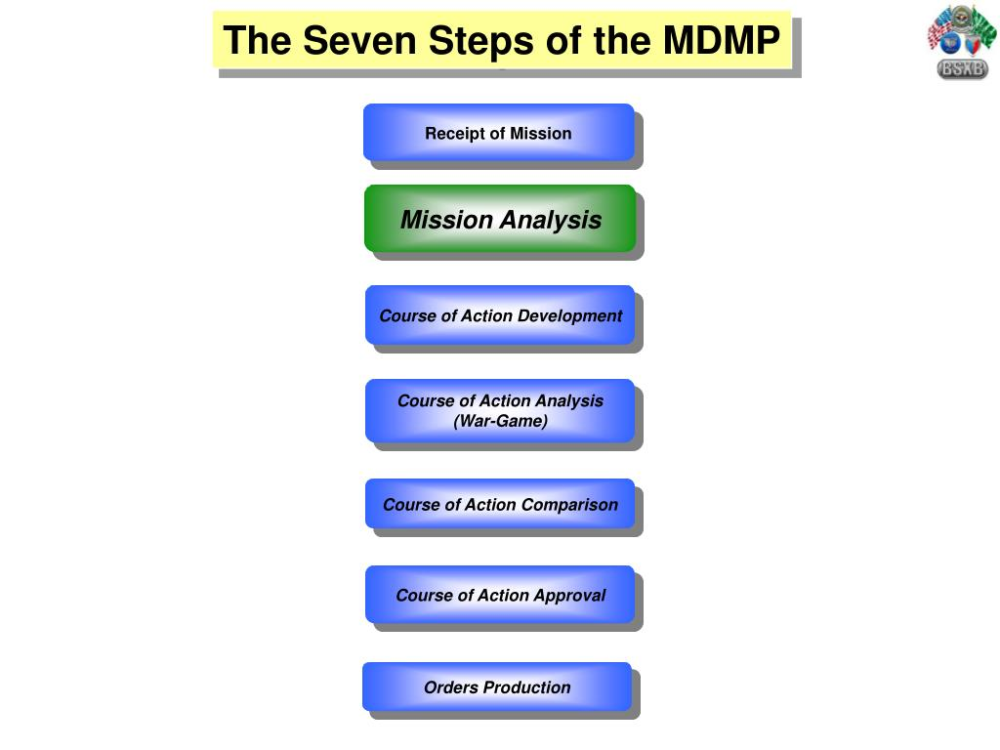
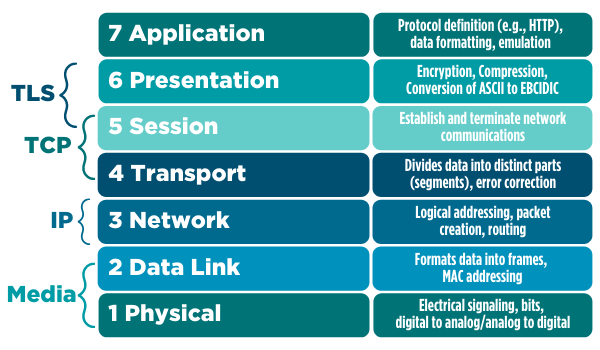

# Troubleshooting

## Methodologies

Troubleshooting is an iteratvie, systamatic process that is repeatable until the issue is fixed. A framwork or methodology may seem like a waste of time but it is far greater use of time. You will not only avoid common troubleshooting pitfalls, but if done correctly you will solidify your current understanding of a system,process, or software.

---

## Comptia Methodology

    1. Identify the Problem
    2. Establish a theory and probably cause
    3. Test the theory to determine the cause
    4. Establish a plan of action to resolve the problem and identify potential effects
    5. Implement the solution or escalate as necessary
    6. Verify full system functionality and, if applicable, implement preventive measures
    7. Document findings, actions, outcomes and lessons learned

There are a few other methodologies that are recognized but they all follow a simliar framework.

We will stick with Comptia Methodology due to its general acceptance and its  close resemblance to...

---

---

### So what does wrong look like?
#### Shotgun Troubleshooting
" We aim in the general direction of the problem and fire multiple projectiles, hoping that one of them hits the mark"
* Undirected changes in 'hope' you will fix the problem.
* Not tracking changes or creating save points.
* Common approach is to change several things at once hoping it fixes the problem (this often leads you into worse problems).

---
# Step 1. Identify the problem
**Identifying symptoms**
Gathering information from log files and error messages
Questioning users
**Determining recent changes**
Duplicating the problem
<u>**Approaching multiple problems one at a time**</u>
Narrowing the scope of the problem
  * But how do you narrow the scope?

---

### Narrowing scope (what is working vs what isnt)

---
#
There are 3 ways to execute using the OSI model.

Bottom up: start at layer 1

Top down: start at layer 7

Divide and conquer: using intuition on obvious cause and start there.
### Layer 1 (Physical)
* Does it have power?
* Is it connected?
* Are there lights? Did something down the line fail?
---
### Layer 2 (DataLink)
* Can you see outside your device?
    * Can container see localhost? Can your local host see VM?
* How far can you ping?
    * traceroute or tracert
* Your layer 2 identifier is your MAC address

* Helful tip (is just this device down?)
---

### Layer 3 (Network)

* Do you have an IP 
* Do you have a public IP?
* Can you ping your default gateway?
* Can you ping past it?
    * Traceroute can help you see if ping dies somewhere
* Do you have a DNS entry?
* Can you resolve other DNS?
    * nslookup SERVERNAME
    * dig ServerName

---
 ### Layer 4 (Transport)
 * Firewall rules (is traffic being blocked)
 * Protocols not working due to latency?

 ### Layer 5 (Session)
 * Permissions on a file system
    * when you change owner (chmod) and disallow a group
* This is where Authentication, Authorization start kicking in
* Session ID and client cookie settings
* Encrption and Decryption methods happen here
    * And can be effected by Layers 1-4, do your settings match the latency? Timeout and keep alive settings?
* Your transport may be working but your protocol may not....FTP vs SFTP may show this.

* User specific permission
 ---
 ### Layer 6 (Presentation)
 * Encryption and certifates
    * SSL certs (are you self signed cert?)
* XML and HTML is now starting to be presented, if you cant see basic HTML page, it could be browser based(firefox,chrome, brave).

---
### Layer 7 (Application)
* This is where issues from software to enduser would appear
* Is there an issue with the code itself
    * Check logs(/var/logs )
* Are applications patched and updated.

---
### Layer 8 (PEOPLE ARE STUPID)
* Did you check all the first steps yourself...or did someone else tell you they checked?

* Are the all the symptoms you are being told, making sense to the facts?

* What is new in the overall envrionment?

* Is there a flaw in the overall design?

* Did you read ALL THE STEPS? DID YOU READ THE MANUAL?
---
# Step 2. Establish a Theory of Probable Cause

Questioning the obvious to identify the cause of the problem

---
# Step 3. Test the theory to determine the cause

Only test 1 thing at a time
If you can replicate testing to validate more than once...do it.

---
# Step 4. Establish a plan
Some fixes require reboots or other more significant forms of downtime
You may need to download software, patches, drivers or entire operating system files before proceeding
Your change management procedures may require you to test modifications to a system’s configuration in a staging environment before implementing the fix in production
You may need to document a series of complex steps, commands and scripts
You may need to back up data that might be put at risk during the recovery
You may need approval from other IT staff members before making changes

---

# Step 5. Implement the solution or escalate as necessary

---

# Step 6. Verify full system functionality and, if applicable, implement preventive measures

---
# Step 7. Document findings, actions, outcomes and lessons learned

---
### Sources 

https://en.wikipedia.org/wiki/Troubleshooting

---